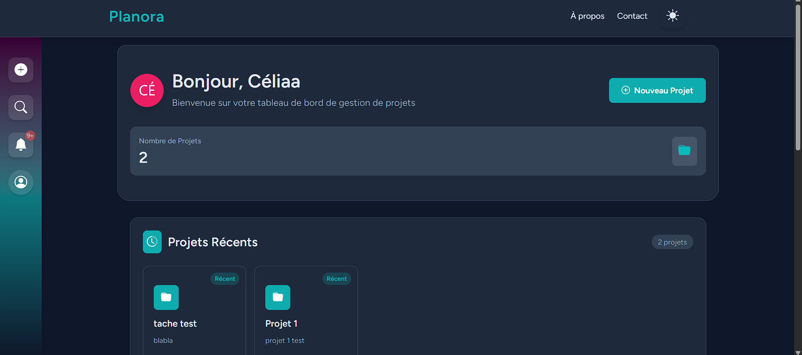
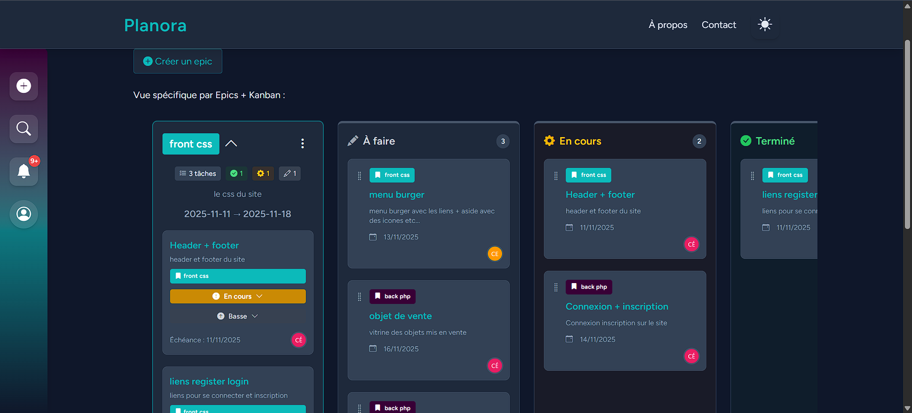

# 📊 SAE 501 - Gestion de Projets Agile

Application web de gestion de projets basée sur la méthodologie Agile, développée avec Laravel et Livewire.

## 🎯 Fonctionnalités

### Gestion de Projets
- Création, édition et suppression de projets
- Gestion des membres et permissions (admin/membre/guest)
- Roadmap visuelle avec timeline interactive
- Suivi des epics et sprints

### Système Agile
- **Epics** : Regroupement de fonctionnalités majeures
- **Sprints** : Organisation en itérations avec dates de début/fin
- **Tâches** : Attribution, priorisation et suivi (À faire, En cours, Terminé)
- Tableau Kanban interactif (drag & drop)
- Roadmap : vue temporelle des sprints et des tâches

### Collaboration
- Notifications en temps réel (tâches, échéances)
- Recherche avancée de tâches
- Avatars personnalisables avec couleurs

### Interface
- Mode sombre/clair
- Composants Livewire réactifs
- Interface avec Tailwind CSS

## 🛠️ Technologies

- **Backend** : Laravel 11.x
- **Frontend** : Livewire 3.x, Tailwind CSS 4.x, Alpine.js
- **Base de données** : MySQL
- **Authentification** : Laravel Breeze
- **Roadmap** : Frappe Gantt
- **Notifications** : Queue 

## 📋 Prérequis

- PHP 8.2+
- Composer
- Node.js 18+ & npm
- MySQL 8.0+
- Serveur web (Apache/Nginx)

## 🚀 Installation

### 1. Cloner le projet
```bash
git clone https://github.com/votre-username/sae501.git
cd sae501
```

### 2. Installer les dépendances PHP
```bash
composer install
```

### 3. Installer les dépendances Node
```bash
npm install
```

### 4. Configuration environnement
```bash
cp .env.example .env
php artisan key:generate
```

Modifier `.env` avec vos informations :
```env
DB_CONNECTION=mysql
DB_HOST=127.0.0.1
DB_PORT=3306
DB_DATABASE=sae501
DB_USERNAME=root
DB_PASSWORD=
# ...
```

### 5. Créer la base de données
```bash
mysql -u root -p
CREATE DATABASE sae501;
exit;
```

### 6. Migrations et seed
```bash
php artisan migrate --seed
```

### 7. Compiler les assets
```bash
npm run build
# ou pour le dev :
npm run dev
```

### 8. Démarrer le serveur
```bash
php artisan serve
```

Accéder à : `http://localhost:8000`

## 📁 Structure du Projet

```
sae501/
├── app/
│   ├── Http/Controllers/     # Contrôleurs (Project, Epic, Sprint, Task)
│   ├── Livewire/             # Composants Livewire (Roadmap, TaskBoard, etc.)
│   ├── Models/               # Modèles Eloquent
│   ├── Policies/             # Autorisations
│   └── Notifications/        # Notifications email
├── database/
│   ├── migrations/           # Schéma BDD
│   └── seeders/              # Données de test
├── resources/
│   ├── views/                # Templates Blade
│   │   ├── projects/
│   │   ├── epics/
│   │   ├── sprints/
│   │   └── livewire/
│   └── css/                  # Styles Tailwind
├── routes/
│   └── web.php               # Routes application
└── public/                   # Assets publics
```

## 🎨 Personnalisation Thème

Les couleurs principales sont définies dans `tailwind.config.js` :

```js
colors: {
  primary: '#0CBABA',    // Cyan
  secondary: '#380036',  // Violet foncé
  // ...
}
```

## Captures d'écran





Ce projet est développé dans le cadre d'un projet universitaire (SAE501).
- **Hoffmann Célia** - Développement initial - 2025
